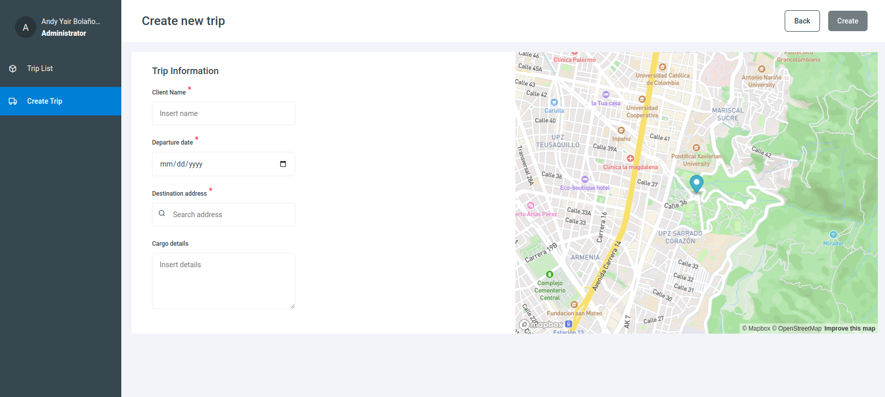

# Shell logistic Project

## Table of Contents
1. [General Info](#general-info)
2. [Technologies](#technologies)
3. [Installation for Development](#Installation-for-Development)
3. [Installation with docker image](#Installation-with-docker-image)

## General Info
We have here an application that integrates all processes related to shipment travel logistics.

🔵 View project running: [sol-shell](https://sol-shell.netlify.app/)



#### Important 📢:
you should know that this project is using the **microfrontend architecture**, making use of an external project called [sol-trip-management](https://sol-trip-management.netlify.app/#/trip/list) to load the trip module.

Here you can see a small scheme to better understand the architecture of this project.


In order to run this project in your local environment you must follow steps:

1. Installation UI sol-shared-library [installation instructions](https://github.com/andybolano/sol-shared-library) 

2. Installation sol-trip-management [installation instructions](https://github.com/andybolano/sol-tripManagement) 

## Technologies
A list of technologies used within the project:
* [VueJS](https://vuejs.org/): Version 3.2.13 
* [Webpack](https://webpack.js.org/): Version 5.89.0
* [Node.js](https://nodejs.org/): Version 16.0.0

## Installation for Development
⚠️ After following the installation steps of the [sol-shared-library](https://github.com/andybolano/sol-shared-library) and the[sol-trip-management](https://github.com/andybolano/sol-tripManagement) projects *make sure that they are  working properly* and follow the next steps:
follow the next steps: 
#### Clone project
```
git clone https://github.com/andybolano/shell
```
#### 📁 Move to the project directory 
```
cd shell
```

#### 🛠️ Install dependencies
```
npm install
```

#### 🏁 Compiles and hot-reloads for development
```
npm run serve
```

The project is configured by default to run on **port 8080**, so you should view it at the following address on your computer [http://localhost:8080/](http://localhost:8082/) 🏁.

## Installation with docker image 🐋


```
$ git clone https://github.com/andybolano/shell
$ cd shell
$ ./start.sh
```
if you are using linux environment and you have permissions problems when executing the command ./start.sh
```
chmod +x start.sh
```

The project is configured by default to run on **port 8082**, so you should view it at the following address on your computer [http://localhost:8080/](http://localhost:8080/) 🏁.
